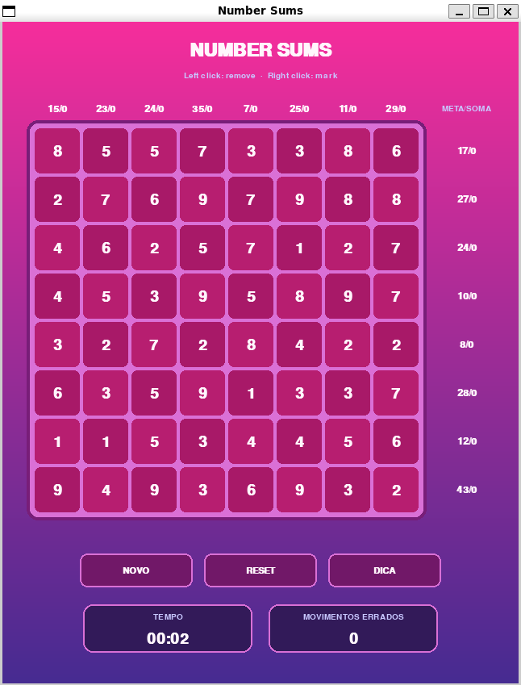

# Number Sums — CSP Search

A Python library, CSP solver, and Pygame application for generating and solving
**Number Sums** (also known as **Sumplete**) boards.

The goal is to remove cells until the remaining numbers in every row and column
add up to their respective targets.

<p align="center">
  
</p>

<p align="center"><em>The default 8 × 8 Pygame interface.</em></p>

The visual direction and documentation structure are inspired by
[solving_sudoku](https://github.com/filipemedeiross/solving_sudoku), adapted
for weighted-sum constraints.

## Features

- Reproducible random boards from `2 × 2` to `8 × 8`.
- Unique solutions by default.
- Remove, restore, mark, unmark, reset, and undo operations.
- Every move is checked against the remaining compatible solutions.
- CSP solving with GAC propagation, MRV/LCV ordering, and backtracking.
- Hints, solution enumeration, search traces, and statistics.
- Mouse-driven Pygame interface and an interactive notebook.

## Installation roadmap

Python 3.10 or newer is required.

```text
clone → create a virtual environment → install the library → install Pygame → run
```

### 1. Clone the repository

```bash
git clone https://github.com/filipemedeiross/number_sums.git
cd number_sums
```

### 2. Create a virtual environment

Linux or macOS:

```bash
python -m venv .venv
source .venv/bin/activate
```

Windows PowerShell:

```powershell
py -m venv .venv
.venv\Scripts\Activate.ps1
```

### 3. Install the library

```bash
python -m pip install --upgrade pip
python -m pip install .
```

This installs the `sumplete` distribution, the `number_sums` Python package,
and the `sumplete-game` command.

### 4. Install Pygame

The graphical application imports Pygame unconditionally. Install the pinned
version from [requirements.txt](requirements.txt):

```bash
python -m pip install -r requirements.txt
```

For development, use an editable installation instead:

```bash
python -m pip install -e ".[dev]"
```

A regular `pip install .` copies the package into `site-packages`. Reinstall it
after source changes, or use editable mode so the environment always reads
from `src/`.

## Running the game

After installing the library and Pygame:

```bash
sumplete-game
```

Equivalent entry points:

```bash
python -m number_sums
python main.py
```

## Controls

| Input | Action |
|---|---|
| Left-click a cell | Remove or restore it |
| Right-click a cell | Mark or unmark it as a cell to keep |
| Hint button | Highlight the next solver suggestion |
| Reset button | Restart the current board |
| New button | Generate a new board |
| Close the window | Exit |

The interface is mouse-only. A hint is highlighted but not applied
automatically.

Each row and column indicator pairs its target with the sum of cells explicitly
marked to remain. An incompatible move is rejected and increases the
incorrect-move counter.

## Library usage

```python
from number_sums import NumberSumsGame

game = NumberSumsGame.random(size=4, seed=42)

hint = game.next_hint()
if hint is not None:
    print(hint.action, hint.coordinate, hint.reason)

# Solving does not modify the game unless the solution is applied.
solution = game.solve()
game.apply_solution(solution)

assert game.is_won()
```

`NumberSumsGame.random()` creates an `8 × 8` board with a unique solution by
default. Set `unique_solution=False` to allow alternatives.

## Solver overview

For an `n × n` board, the solver creates one Boolean variable per cell:

$$
x_{r,c} =
\begin{cases}
1 & \text{keep the cell} \\
0 & \text{remove the cell}
\end{cases}
$$

Each row and column becomes a weighted-sum constraint:

$$
\sum_{c=0}^{n-1} a_{r,c}x_{r,c} = row\_target_r
$$

$$
\sum_{r=0}^{n-1} a_{r,c}x_{r,c} = column\_target_c
$$

The model therefore contains `n²` variables and `2n` constraints.

The solver works in four stages:

1. It precomputes the keep/remove masks that satisfy each row or column.
2. Generalized Arc Consistency removes values with no supporting mask.
3. If propagation is not enough, MRV/LCV guide a backtracking search.
4. A reversible trail restores domains when a branch fails.

`solve_with_trace()` can record propagation, decisions, contradictions,
backtracks, solutions, and search counters. `next_hint()` uses the current game
decisions and returns one compatible remove-or-keep suggestion.

Boards are limited to `8 × 8`. Each constraint has at most `2ⁿ` masks, while
the complete search remains exponential in the worst case.

## Project structure

```text
number_sums/
├── docs/game.png
├── notebooks/1_game_logic.ipynb
├── src/number_sums/
│   ├── game.py
│   ├── controller.py
│   ├── pygame_app.py
│   └── solvers/csp.py
├── tests/
├── pyproject.toml
└── requirements.txt
```

## Notebook

[`notebooks/1_game_logic.ipynb`](notebooks/1_game_logic.ipynb) demonstrates
board generation, solving, and a text-based game.

```bash
python -m pip install -e ".[dev]"
jupyter lab notebooks/1_game_logic.ipynb
```

## Tests

Run the complete `unittest` suite:

```bash
PYTHONPATH=src python -m unittest discover -s tests -v
```

Run a single test module:

```bash
PYTHONPATH=src python -m unittest -v tests.test_csp_solver
```

In a headless environment:

```bash
SDL_VIDEODRIVER=dummy \
PYTHONPATH=src \
python -m unittest discover -s tests -v
```

## References

- [filipemedeiross/solving_sudoku](https://github.com/filipemedeiross/solving_sudoku)
- Stuart Russell and Peter Norvig,
  [*Artificial Intelligence: A Modern Approach*](https://aima.cs.berkeley.edu/)
- David Poole and Alan Mackworth,
  [*Generalized Arc Consistency*](https://www.cs.ubc.ca/~poole/aibook/3e/html/ArtInt3e.Ch4.S3.html)
- Alan K. Mackworth,
  [“Consistency in Networks of Relations”](https://www.cs.ubc.ca/~mack/Publications/b2hd-AI77.html),
  *Artificial Intelligence*, 8(1), 1977
- [Pygame documentation](https://www.pygame.org/docs/)
- [pip local project installation](https://pip.pypa.io/en/stable/topics/local-project-installs/)

## License

Released under the MIT License. See [LICENSE](LICENSE).
